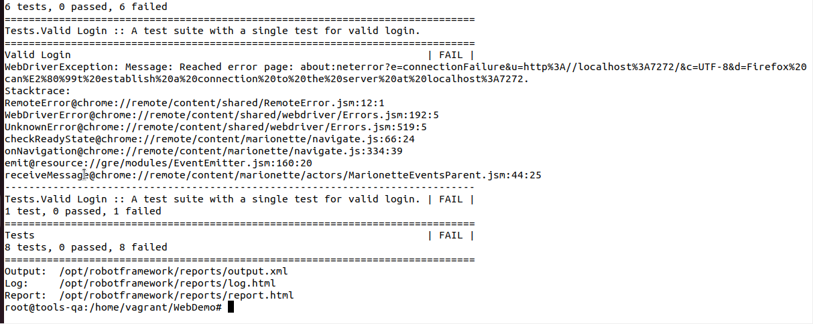

# Ambiente de QA com Android Studio

## Environment

Nome       | vCPUs | Memoria RAM | IP            | S.O.¹           | Script de Provisionamento²
---------- |:-----:|:-----------:|:-------------:|:---------------:| -----------------------------
tools-qa       | 1     | 4096 MB      | 172.16.0.100 | ubuntu/jammy64 | 

```
git clone https://github.com/silvemerson/tools-qa.git

cd tools-qa.git

vagrant up

```

## Principais componentes instalados

 - Anndroid Studio
 - Google Chorme
 - Python3
 - Docker 


## Teste via terminal

O objetivo é validar o login de uma aplicação Web de exemplo

**Start da aplicação** 

```python3 /home/vagrant/WebDemo/demoapp/server.py &```

**Executando Robot Framework para testar aplicação**

```docker run -v /home/vagrant/WebDemo/login_tests:/opt/robotframework/tests:Z -e BROWSER=chrome ppodgorsek/robot-framework:latest```

### Expectativa de resultado pós teste




## Teste baseado no projeto: [docker-robot-framework](https://github.com/ppodgorsek/docker-robot-framework)


